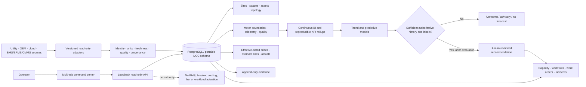
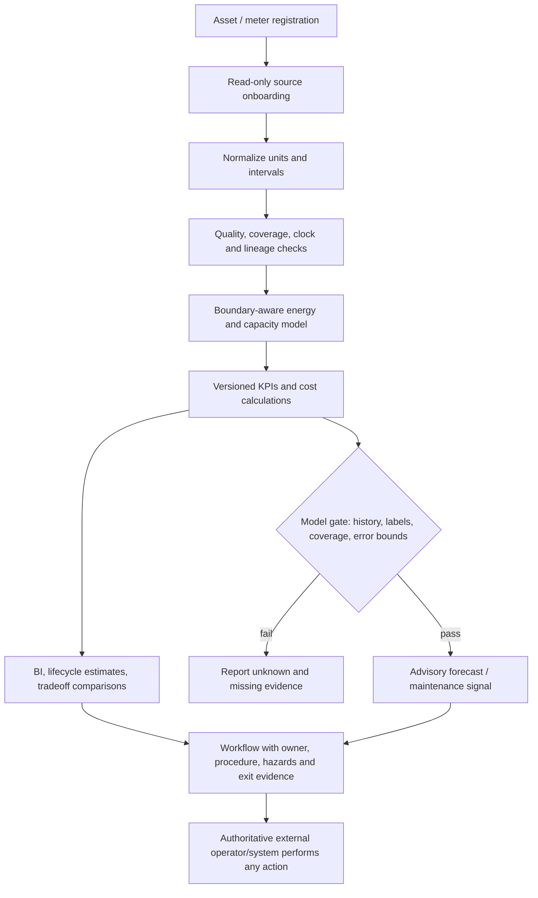

# Data Center Commander

**An open, operator-centered system for governing the full data-center lifecycle—from utility boundary to useful compute.**

Data Center Commander is a standalone, vendor-neutral operations and decision-support project. It joins facility, energy, environmental, asset, workload, capacity, maintenance, incident, change, and evidence data under one tenant-scoped operational model. It is not a BMS, EPMS, CMMS, hypervisor, scheduler, or safety controller; those systems remain authoritative for their domains.

## Product contract

- Energy-to-compute is measured with explicit meter boundaries, aligned intervals, units, quality, source lineage, and allocation uncertainty.
- Every KPI is reproducible from named source observations and a versioned calculation definition; missing inputs produce `unknown`, not zero.
- All integrations begin read-only. Every connector declares identity, endpoint, scopes, version, freshness, rate limits, and tested capabilities.
- Workflows are durable records with owner, stage, approvals, procedure version, hazards, evidence, exit criteria, and handoff. The project does not actuate electrical, cooling, fire, or life-safety controls.
- No synthetic readings appear as live data. Synthetic demo data is opt-in, visibly tagged, and reset only in a specifically named demo database.
- The OSS core uses portable PostgreSQL SQL and can be adapted to Supabase. Supabase Auth/RLS is a deployment adapter, not a dependency of the domain model.

## Standalone layout

```text
data-center-commander/
├── database/       portable schema, optional synthetic seed, guarded reset
├── docs/           architecture, lifecycle, data/KPI, adapters, security, runbooks
├── scripts/        local startup, safe bootstrap, demo-only seed/reset
├── src/dcc/        loopback read-model API
├── tests/          API/schema contract tests
└── ui/             live command-center view (no fabricated readings)
```

Lifecycle sizing, dated price observations, estimate-to-actual accounting and
unit economics are documented in [`docs/COST_ESTIMATING_AND_UNIT_ECONOMICS.md`](docs/COST_ESTIMATING_AND_UNIT_ECONOMICS.md).
Purple-team telemetry-validation lab boundaries and the read-only connector readiness gate are documented in [`docs/PURPLE_TEAM_READINESS.md`](docs/PURPLE_TEAM_READINESS.md).
Existing databases created before this module should apply
[`database/migrations/001_cost_intelligence.sql`](database/migrations/001_cost_intelligence.sql)
then [`database/migrations/002_lifecycle_rollup_fix.sql`](database/migrations/002_lifecycle_rollup_fix.sql)
then [`database/migrations/003_estimate_price_link_validation.sql`](database/migrations/003_estimate_price_link_validation.sql)
then [`database/migrations/004_placement_comparison_snapshots.sql`](database/migrations/004_placement_comparison_snapshots.sql)
once each; new databases receive the tables and corrected rollup through
`database/schema.sql` plus migration 004. Existing synthetic demo databases can add the cost-only
fixture with `database/cost_demo_seed.sql`.

Placement comparisons may be saved as append-only draft snapshots. They are
tenant-scoped and hashed, but retain browser-calculated results and are not
approved estimates. Apply migration 004 before using Save draft snapshot.
The local API remains unauthenticated and loopback-only; do not expose it remotely.

## Local development

Requires Python 3.11+ and PostgreSQL 14+. Do not point the demo at a production database.

```bash
cd data-center-commander
uv sync --extra postgres
createdb data_center_commander_dev
export DCC_DATABASE_URL='postgresql://127.0.0.1/data_center_commander_dev'
psql "$DCC_DATABASE_URL" -v ON_ERROR_STOP=1 -f database/schema.sql
uv run --extra postgres python scripts/run-local.py --host 127.0.0.1 --port 8790
```

Open `http://127.0.0.1:8790/`. The API refuses non-loopback binds. Apply the
schema to a new database only. To see a clearly synthetic walkthrough, use the
separately gated instructions in [`docs/LOCAL_DEVELOPMENT.md`](docs/LOCAL_DEVELOPMENT.md).
`/healthz` reports process liveness; `/readyz` succeeds only when PostgreSQL,
the required schema tables, and forced tenant RLS are available. The local
service still has no user authentication and must not be exposed remotely.

Run tests with:

```bash
uv run --extra test python -m unittest discover -s tests -v
```

## What works now / what does not

The first executable slice is deliberately small: a local PostgreSQL-backed,
read-only facility/KPI command view, health/read-model routes, portable schema,
tenant RLS, and explicitly synthetic demo population. Without applied schema
and authorized source data, it reports the missing state. No vendor, cloud,
building-management, meter, or hypervisor credentials are bundled; no live
telemetry adapter is claimed by this starter. Adapter contracts and staged
onboarding plans are in [`docs/INTEGRATIONS.md`](docs/INTEGRATIONS.md).

The comprehensive target architecture and lifecycle are documented in
[`docs/ARCHITECTURE.md`](docs/ARCHITECTURE.md),
[`docs/LIFECYCLE_OPERATIONS.md`](docs/LIFECYCLE_OPERATIONS.md),
[`docs/DATA_MODEL_AND_KPIS.md`](docs/DATA_MODEL_AND_KPIS.md), and
[`docs/OPERATOR_WORKFLOWS.md`](docs/OPERATOR_WORKFLOWS.md).

## Safety and authority boundary

See [`docs/SECURITY_AND_GOVERNANCE.md`](docs/SECURITY_AND_GOVERNANCE.md). This
starter is observation and decision-support only. It contains no generic shell,
remote desktop, BMS write, breaker/switch control, setpoint change, VM lifecycle,
or workload dispatch path. Recommendations are not commands. Any future
execution adapter requires a separate, independently reviewed project gate.

## Local synthetic walkthrough

After applying the normal schema and demo seed, add the optional additive
30-day history using `database/demo_analytics_expansion.sql` against only the
specifically named local demo database. The script adds 15-minute interval
energy and derived daily energy/PUE points; modeled thermal, carbon,
compute-efficiency and headroom values are explicitly marked synthetic. It is
idempotent and does not reset or delete data.

Open the local UI with the seeded tenant and explicit demo switch:

```text
http://127.0.0.1:8795/?tenant_id=dcc00000-0000-4000-8000-000000000001&demo=synthetic
```

Without `demo=synthetic`, synthetic facility KPIs and synthetic cost-book rows
remain quarantined from the operational view. Demo mode is presentation-only:
all data remain visibly tagged, price assumptions are not market quotes, and
forecasts stay disabled where minimum history or authoritative labels are
missing. It never enables facility actuation or other writes. See
[`docs/LOCAL_DEVELOPMENT.md`](docs/LOCAL_DEVELOPMENT.md) before running seeds.

## Architecture at a glance





## Roadmap

| Stage | Deliverable | Acceptance evidence |
|---|---|---|
| 0 · Local command center | Portable schema, guarded demo seed, 30-day synthetic history, overview/energy/BI/economics/workflow/evidence panels | API/schema tests, source labels, rerunnable additive seed, repeatable screenshots/GIF committed in `docs/media/` |
| 1 · Source onboarding | Read-only connector registry, onboarding wizard, identity/scope/freshness checks, import previews | Vendor sandbox contracts, malformed/stale-data tests, secret-reference-only config, operator-confirmed mapping |
| 2 · Data quality and BI | Boundary-aligned intervals, missingness/coverage budgets, versioned formulas, KPI lineage and cost actual reconciliation | Reproducible queries, boundary tests, quality SLOs and calculation manifests |
| 3 · Predictive maintenance | Condition features, work-order/failure labels, maintenance history, interpretable forecasting and drift | Time-split backtests, calibration/error analysis, leakage checks, minimum-history gates and human disposition |
| 4 · Lifecycle and economics | Sourced dated prices/tariffs/contracts, quantity takeoff, contingency/escalation/FX, estimate-to-actual and unit economics | Source digest, review/expiry policy, uncertainty ranges, independent Finance/Facilities review |
| 5 · Production hardening | AuthN/AuthZ, tenant isolation, secret manager, migrations, backups/restore, observability, incident handling, HA | Threat review, penetration tests, recovery drill, SLOs, runbooks, privacy/retention signoff |
| 6 · Certified ecosystem | OEM/cloud/facility adapter conformance, optional enterprise analytics and support | Conformance suite and customer-controlled credentials/export; portable core remains OSS |

The roadmap is an implementation sequence, not a readiness claim. The current
local API is unauthenticated and must remain loopback-only; vendor/cloud live
adapters, validated forecasts, production IAM and safety-control integration
are not delivered by this starter.

### Demo artifacts

The local walkthrough is available at
`http://127.0.0.1:8795/?tenant_id=dcc00000-0000-4000-8000-000000000001&demo=synthetic`.
Screenshot and GIF files are a pre-release checklist item and are not committed
yet; do not treat this README as claiming those media assets exist. Capture them
from this explicit synthetic view, preserve the `SYNTHETIC DEMO · NOT LIVE`
notice, and place the reviewed files in `docs/media/` before publishing. No live
connector or physical-system action is part of the walkthrough.

## License

This project is licensed under the GNU Affero General Public License v3.0
(AGPL-3.0-only); see [LICENSE](LICENSE).
