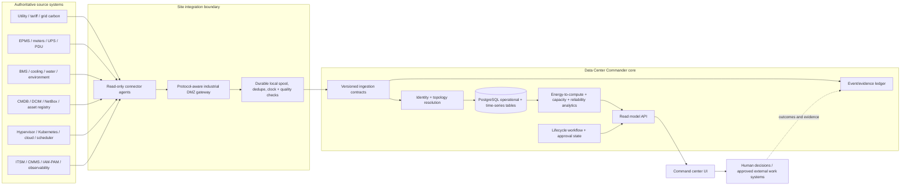

# Data Center Commander architecture

## Operating model

The platform is a data and workflow coordination layer. It receives observations
from approved systems, maps them to a time-versioned facility/asset/workload
graph, evaluates data quality and operational rules, and gives accountable
operators evidence-backed decisions. It does not replace domain authorities.

## Trust boundaries

1. **Enterprise/control networks to site DMZ:** outbound-only where possible;
   protocol translation and allowlists at a reviewed gateway. No general-purpose
   agent or message broker is placed on safety or control networks.
2. **Connector to ingestion:** connector identity is workload-bound; endpoints,
   read scopes, certificate/key references, rate budgets, and source version are
   operator-provisioned. Payload is treated as untrusted input.
3. **Ingestion to canonical records:** schema validation, tenant binding,
   identity mapping, dedupe, bounded payloads, timestamps/units, quality flags,
   provenance, and replay protection happen before data enters read models.
4. **Analytics to decision:** analytics are advisory, carry input lineage and
   uncertainty, and cannot create infrastructure commands. Critical operations
   remain owned by qualified human operators and existing control systems.
5. **Tenant to database:** every tenant row is RLS-scoped. Service roles use
   least privilege and transaction-local tenant context. Supabase deployments
   must separately prove Auth claims, RLS, grants, and service-role isolation.

## Bounded contexts

| Context | Owns | Does not own |
|---|---|---|
| Organization & estate | tenants, sites, campuses, rooms, racks, zones, asset graph | physical truth without a source observation |
| Telemetry & provenance | connector contracts, readings, quality, timestamps, calibration references | source device control |
| Energy & sustainability | boundaries, interval accounting, tariff/carbon factors, PUE/WUE and allocation | utility billing truth or carbon certification |
| Compute & service | clusters, hosts, accelerators, workloads, service objectives, placements | scheduler/hypervisor command authority |
| Capacity & resilience | usable capacity, reserves, dependencies, failure scenarios, forecasts | declaring untested redundancy safe |
| Maintenance & reliability | asset history, condition indicators, work orders, failure analysis | CMMS work execution or safety permit issuance |
| Operations & governance | incidents, changes, approvals, SOPs, evidence, handoffs | emergency command authority |
| Analytics & reporting | versioned metric definitions, quality coverage, decision records | unsourced or incomparable rankings |

## Data and event flow

`source envelope -> validated raw observation -> normalized measurement ->
asset/topology link -> quality decision -> derived metric -> operator review ->
work record -> observed outcome -> evidence closeout`.

Raw source facts are immutable or versioned; corrections append a superseding
record. Derived records name formula version, source IDs/time ranges, meter
boundary, allocation method, quality gates, and uncertainty. Event consumers
must be idempotent by `(tenant_id, source_id, source_event_id)` and tolerate
late, duplicated, out-of-order, and replayed messages.

## Scaling path

- Keep reference data relational and tenant-partitioned; index high-cardinality
  access by `(tenant_id, asset_id, metric_id, observed_at)`.
- Start with PostgreSQL and monthly partitioning when measured row volume merits
  it. Adopt TimescaleDB or a columnar lake only behind the same measurement and
  provenance contract, with retention/rollup policy and export verification.
- Separate hot raw telemetry, compacted hourly/daily rollups, and immutable
  evidence. Do not store full payload copies in every dashboard read model.
- Use bounded ingestion batches, per-source back-pressure, DLQ/quarantine,
  idempotency keys, cursor checkpoints, exponential retry with jitter, and
  circuit breakers. Surface lag and dropped/duplicate counts.
- Cache only versioned derived read models; invalidate by source watermark,
  formula version, asset-graph version, and tenant.
- Load-test representative intervals, asset counts, source fan-in, late events,
  tenant isolation, query concurrency, and recovery from backlog. Publish the
  test data shape, hardware, p95/p99, error budget, and correctness checks.

## Deployment shapes

Local single-node PostgreSQL is for engineering and synthetic demonstrations.
Site-edge collectors buffer during WAN loss; regional services aggregate
approved site data; a central control view joins regions only where residency
and tenant policy permit. A Supabase deployment is one managed Postgres/Auth/
Realtime/Storage option, not the architecture itself. Multi-site failure must
not disable local facility controls.
