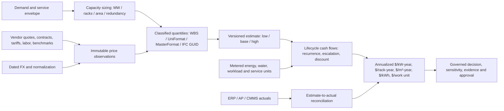

# Sizing, price intelligence, lifecycle estimating, and unit economics

This module makes the design-to-operations cost chain explicit. It is not a
substitute for an engineer's signed load schedule, quantity surveyor takeoff,
vendor tender, utility tariff, finance approval, or accounting system.

## Sizing and quantity takeoff

Size against an approved demand envelope: contracted and forecast IT load,
coincident peak, utilization/growth, rack power density, compute/storage/network,
latency/sovereignty, N/N+1/2N topology, planned maintenance, and failure-domain
scenarios. Keep IT critical load, facility input, usable capacity, policy reserve,
and nameplate capacity as distinct quantities. Space quantities include white
space, electrical/mechanical rooms, yard, cable routes, service clearances, and
future phases. Avoid converting gross floor area to IT capacity with an implicit
constant.

`estimate_projects` versions the project assumptions and denominators.
`estimate_line_items` stores quantity, normalized unit, waste factor, low/base/high
rate, cost behavior, useful life, recurrence, escalation, phase, and optional
classification/asset/IFC GlobalId links. IFC/BIM is one source of geometry and
element identity; engineering schedules, asset registers, quotes, and site
surveys remain separate sources with reconciliation checks. Never count the
same item from both an IFC takeoff and an equipment schedule without deduplication.

## Price collection and source quality

`price_observations` is append-only in intent: corrections create a new
observation. Capture SKU/model, unit, currency, country/site geography, delivery
basis (ex-works/FOB/CIF/delivered/installed/metered), taxes/exclusions, quote or
contract reference, source digest, observed time, effective dates, FX basis date,
normalization factor, confidence, review state, and provenance. Keep rate-card,
discount, freight, duty, installation, commissioning, spares, and warranty as
separate cost components if they differ materially.

Accepted source families: authorized vendor/partner APIs and price books; dated
vendor quotations and contracts; published utility tariff schedules and bills;
approved public/industry benchmarks; labor and construction schedules; and
controlled manual entry. Connector credentials belong in a secret manager, not
the cost book. An integration run must retain source version, pagination/cursor,
currency/unit conversion, rejected-row count, source timestamp, and digest.
Vendor/utility adapter availability is shown in `docs/INTEGRATIONS.md`; a listed
vendor is not evidence that an adapter exists. The currently seeded price rows
are synthetic test fixtures only.

Select a rate by item/model, normalized unit, geography, price basis, effective
date, currency and approval status. Reject expired, mismatched or ambiguous rates;
do not silently fall back to another region or currency. Keep competing quotes
and approval records. Low/base/high are documented estimate bounds, not
statistical confidence intervals unless a model explicitly says so.

## Lifecycle cost and accounting

Classify cost by lifecycle phase and accounting type: land/site diligence,
design, civils, utility/interconnect, electrical, mechanical, IT, network,
software/licenses, labor, commissioning, energy/demand charges, water, carbon,
maintenance/spares, tax, financing, refresh/replacement, residual value, and
decommissioning. Use separate capital/expense and cash/accrual treatments; local
accounting policy decides capitalization and depreciation. Keep contingency,
schedule escalation, FX, taxes, discount rate, and financing explicit. The
rollup calculates dated low/base/high present values from one-off or recurring
cash-flow lines; assumptions remain attached. It does not invent salvage value,
tax treatment, utility demand charges, or a probability distribution.

`cost_actuals` accepts periodized ERP/AP/utility/CMMS actuals with source system,
account code, invoice digest, accrual state, facility/asset and estimate-line
links. `cost_allocations` assigns shared costs to workloads with a named method,
interval, allocation fraction, formula version, and evidence. Reconcile
allocated totals to ledger totals; residual/unallocated amount stays visible.
Budget-vs-actual, estimate-at-completion and variance become reliable only when
period, accounting basis, currency and scope align.

## Unit economics

For present value `PV`, horizon `n` years, annual discount rate `r`, the
equivalent annual cost is `PV/n` when `r=0`; otherwise
`PV × r / (1 - (1+r)^(-n))`. Normalize this annual cost by measured/design
denominators only when their scopes match:

- USD or tenant currency / IT kW-year; USD / rack-year; USD / gross or IT m²-year.
- Energy OPEX / metered IT kWh and total facility kWh (report both boundaries).
- Allocated lifecycle cost / verified useful workload unit (requests, jobs,
  tokens, transactions or other domain unit); preserve SLO/service tier.
- Cost per available service-hour and cost of unavailability only with an
  explicitly approved reliability/business-impact model.

The UI returns “Not priced” for absent prices and “Unknown” for absent or zero
denominators. It displays the first estimate's normalized cards and each estimate's
low/base/high PV, line counts, unpriced count and synthetic provenance. A card is
not a financial recommendation. No procurement, billing, dispatch or control
write is performed.

## Scale, controls and next adapters

Indexes are tenant-first and cover approved-rate lookup, estimate rollups,
accounting period, and workload/time. Store source price history rather than
overwriting it; partition only after measured volume warrants it. API reads are
tenant-scoped and read-only. Supabase deployments must retain RLS on every new
table and verify view access under non-owner roles.

The schema defines integration-ready storage, not live price-feed adapters.
Production ingestion should add one isolated, read-only adapter per vendor/utility
or accounting source, with per-connection allow-listed hosts/scopes, credential
references, rate limits, schema validation, idempotency keys, quarantine for
unmatched rows, and human approval before a rate becomes selectable. Avoid web
scraping sites that prohibit it or bypassing contract/access restrictions.
