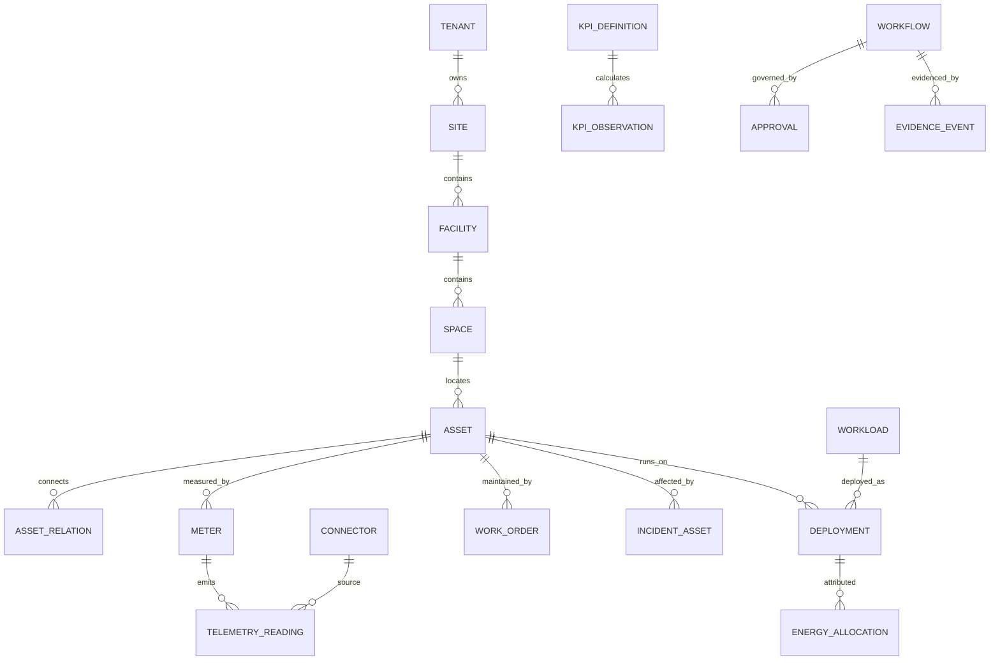

# Canonical data and analytics model

## Core entities

### Identity and topology

`tenant -> region/campus/site -> facility -> room/zone -> row/rack -> asset`.
Asset classes cover utility boundary, switchgear, transformer, UPS, generator,
ATS, PDU/busway, meter, chiller/CRAH/CRAC/CDU/pump/tower, leak/fire/environment
sensor, network, server, accelerator, storage, hypervisor, cluster, workload,
and service. Relationships are typed, time-bounded, sourced, and confidence-
scored (feeds, backs-up, cools, powers, contains, hosts, depends-on, serves).
Conflicting external IDs are retained with source namespaces until resolution;
never silently merge two devices by display name.

### Telemetry envelope

Minimum normalized reading fields: tenant, source connector and version,
source event ID, external asset/meter identity, metric ID, observed and ingested
timestamps, numeric value, unit, quality/status, sample interval, calibration
reference, source cursor, and provenance digest. Store raw payload only where
necessary with encryption/retention controls; canonical readings should be
small. Deduplicate by `(tenant, connector, source_event_id)` and keep corrections
as superseding readings. Store UTC instants while retaining source timezone and
clock offset. Units use canonical SI internally and preserve reported unit.

### Quality vocabulary

`good`, `estimated`, `suspect`, `bad`, `missing`, `stale`, `late`, `replayed`,
`clock_skew`, `out_of_range`, `uncalibrated`, `superseded`. A quality rule has a
version, threshold, interval, metric, and facility context. Consumers choose an
explicit quality policy; no global implicit filtering.

## Aggregation and formulas

- Energy: integrate power over interval only with sample semantics documented;
  preserve direct interval kWh when the meter supplies it.
- PUE: `facility_energy / IT_energy` only for matching site, timezone-aligned
  interval, compatible meter boundary, and required quality coverage. Otherwise
  return unavailable plus reason codes.
- Compute efficiency: verified useful workload units divided by attributable
  kWh; state allocation tier and confidence interval. A GPU utilization percent
  is not useful work.
- Cost: interval kWh × applicable effective tariff, plus explicitly modelled
  demand/tax components. Record tariff version and currency conversion time.
- Carbon: interval energy × time/location/method-specific emission factor.
  Preserve factor source, market/location basis, scope, uncertainty, and revision.
- Cooling/water: state meter boundary and distinguish evaporative, liquid-loop,
  and purchased-water scope. Never compare WUE across materially different
  reporting/operational definitions without normalization.
- Capacity: free = validated usable - reservations - policy reserve; scenario
  capacity additionally evaluates planned maintenance and failure domains.

Each KPI definition specifies key, version, formula/query, unit, dimensions,
quality requirements, minimum coverage, interval, aggregation method, provenance
shape, and owner. KPI observations are append-only and carry calculation hash,
source watermark, start/end, numerator/denominator, coverage, uncertainty, and
status/reason codes.

## Data retention and scale

Keep raw readings for policy-defined hot retention, derived rollups for agreed
operational/audit horizons, and evidence digests/decision records according to
legal retention. Partition by time and tenant only after measured scale requires
it; avoid partitioning that destroys useful uniqueness or RLS. Retention and
export are per-tenant policy. Supabase migration must verify RLS on partitions,
views, functions, and service-role routes.
