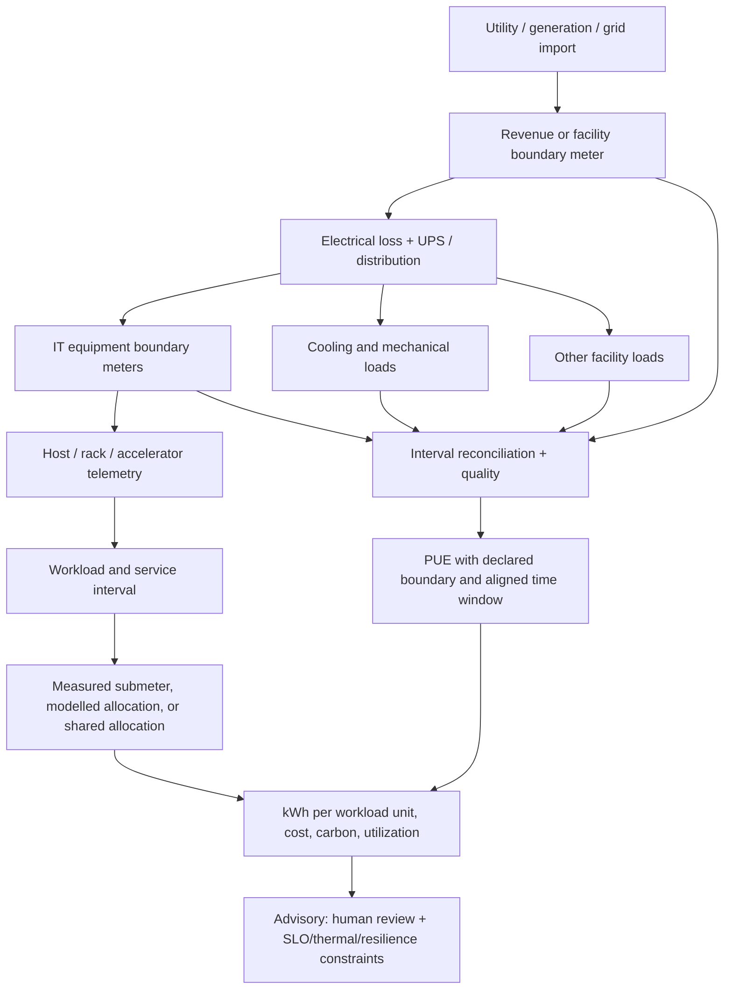

# Full data-center lifecycle and energy-to-compute operations

The system models the lifecycle from demand and site strategy through
decommissioning, plus the continuous operate/maintain/optimize loop. Each stage
has an accountable owner, decision record, constraints, source evidence, and
exit gate. The named process owner may vary by organization; electrical,
mechanical, IT, security, sustainability, finance, and safety responsibilities
must be explicit rather than collapsed into an AI agent.

## Lifecycle map

| Stage | Core work | Gate/evidence |
|---|---|---|
| 1. Demand & service strategy | service demand, latency/availability, geography, sovereignty, growth bands, workload energy budgets | approved demand envelope, assumptions, risk and cost range |
| 2. Site/utility diligence | utility capacity, interconnect, tariff, carbon, water, climate, land, fiber, hazards, permits | independently verified site constraints and utility commitments |
| 3. Concept & design | topology, N/N+1/2N, electrical one-line, cooling, fire/life safety, security zones, rack density, liquid loop | stamped design approvals remain with licensed authorities; model traceability |
| 4. Procurement & supply chain | long-lead transformers, switchgear, UPS, generators, chillers/CDUs, racks, servers, GPUs, software and spares | approved BOM, vendor assurance, lead-time and obsolescence risk |
| 5. Build & install | civils, utility entrance, electrical rooms, plant, white space, cabling, grounding, rack, asset receipt | permit-to-work, inspections, serial/lot provenance, as-built revisions |
| 6. Commission & integrated systems tests | factory/site acceptance, protection, transfer, load-bank, cooling modes, leak detection, alarms, failover | witnessed test scripts/results, corrective actions, safe energization sign-off |
| 7. Service onboarding | service owner, workload class, SLO, dependencies, target zone, resource reservation, energy/cost policy | service record, placement limits, rollback/continuity plan |
| 8. Operate | shift handover, alarm triage, daily checks, access review, data-quality review, service capacity review | time-stamped checklists, owner acknowledgement, unresolved-risk queue |
| 9. Capacity & change | power/thermal/network/storage/GPU headroom; reserve, maintenance, failover and growth scenarios | approved change window and post-change validation; no single-metric capacity claim |
| 10. Maintain & reliability | condition monitoring, planned work, spares, OEM advisories, calibration, failure mode analysis | CMMS work order, safety permit in authoritative system, tested restoration |
| 11. Incident & continuity | classify, protect people, notify qualified owner, bound impact, continuity and restoration coordination | timeline, decision log, verified service/facility state, lessons learned |
| 12. Optimize energy-to-compute | meter reconciliation, workload attribution, idle analysis, cooling and scheduling advisories | shadow-mode evidence with uncertainty, SLO and fairness impacts |
| 13. Compliance & assurance | access, safety, environmental, resilience, asset, change, supplier, and evidence audits | traceable control evidence, gap owner, due date, closure proof |
| 14. Refresh & migration | lifecycle risk, vendor end-of-support, workload migration, capacity bridge, data sanitization | approved migration, validated service continuity, chain of custody |
| 15. Decommission & reuse | isolate, drain, disconnect under authority, remove media, hazardous materials, reuse/recycle, contract closeout | verified zero service dependency, media disposition certificate, energy baseline update |

## Energy-to-compute accounting

An energy claim is meaningful only for an explicit site, meter boundary,
interval, source quality, workload cohort, allocation tier, and formula version.

Allocation tiers must be visible: **direct meter**, **device telemetry model**,
**capacity-share model**, or **unallocated**. Report allocation error bounds.
Never distribute shared overhead as if directly metered. Reject comparisons with
misaligned intervals, meter resets, uncalibrated sources, gaps above policy, or
incompatible facility/IT boundaries. PUE must state standard/version, boundary,
reporting period, excluded loads, and uncertainty; do not present one number as
a universal facility grade.

## KPI catalog (versioned, quality-gated)

| KPI family | Examples | Required dimensions/guardrails |
|---|---|---|
| Energy | facility and IT kWh, peak demand, energy balance residual, PUE | boundary, interval, meter coverage, calibration, uncertainty |
| Compute efficiency | useful workload units/kWh, GPU-hours/kWh, idle/base load, utilization | named workload cohort, SLO class, allocation tier, workload completion validation |
| Cooling & water | cooling kW/IT kW, supply/return ΔT, WUE, thermal margin | climate, cooling topology, sensor location/quality, approved limits |
| Cost | tariff cost, demand charge exposure, cost/service unit | tariff version, timezone, taxes/currency, interval completeness |
| Carbon | kgCO2e by interval, location/market-based scope, carbon-aware shift opportunity | factor source/time/geography, accounting method, uncertainty |
| Capacity | usable/reserved/free by power, cooling, rack, network, storage, CPU/GPU | redundancy and maintenance cases, peak forecast, reserve policy |
| Reliability | availability, alarm-to-owner, MTTR, repeat failure, maintenance compliance | service boundary and incident definition, censored/unknown state handling |
| Operations | change success, work backlog, stale telemetry, access review completion | source lineage, denominator, exclusions, accountable owner |

## Predictive maintenance and analytics

Predictive models are advisory and must report input freshness, missingness,
calibration, confidence intervals, alert horizon, false-negative/positive cost,
and model version. Features may include vibration, temperature, pressure,
current, battery impedance, starts/transfers, alarm patterns, work history,
asset age, operating envelope, and OEM limits. Avoid training labels inferred
from closure codes without validation. Evaluate by asset family/site/time split;
record operator disposition and actual outcome; guard against leakage and
seasonality. A high-risk prediction creates a qualified-owner review/work-order
recommendation, not an automatic shutdown or setpoint command.

## Continuous BI and forecast lifecycle

Every report records as-of watermark, source completeness, calculation/model
version, dimensions, and whether figures are observed, allocated, estimated, or
forecast. Forecasts include baseline, interval, scenario, error history, and
revision. Corrections never rewrite prior operator decisions: they create a new
version and recalculate a linked view. The audit view must reproduce the number
shown at the time a decision was made.
