# Data Center Commander — Optimization Architecture

## Executive Summary

This document identifies performance bottlenecks, NP-hard optimization problems, and architectural gaps in the current Data Center Commander codebase, then proposes modular solutions with mermaid architecture diagrams.

**Current State:** 476-line monolithic API, 352-line schema, 84KB single-file UI, no pagination, no caching, no partitioning, no async I/O.

**Target State:** Modular, async, partitioned, cached, with NP-hard optimization kernels.

---

## 1. System Architecture (Current vs Target)

### Current Architecture

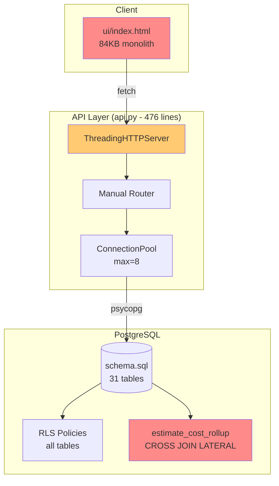

### Target Architecture

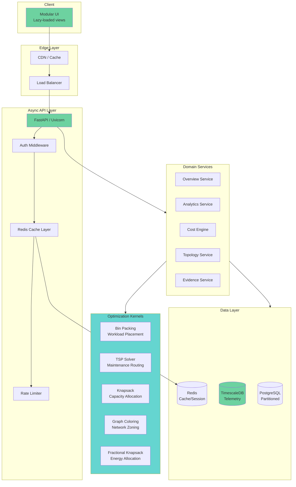

---

## 2. Identified Bottlenecks

### 2.1 API Layer Bottlenecks

| # | Bottleneck | Location | Severity | Impact |
|---|-----------|----------|----------|--------|
| B1 | ThreadingHTTPServer (sync, GIL-bound) | api.py:467 | Critical | Max ~8 concurrent requests |
| B2 | No pagination on any endpoint | api.py:221-411 | Critical | Unbounded memory growth |
| B3 | 4 sequential queries in /v1/analytics | api.py:261-305 | High | 4× latency |
| B4 | No caching layer | api.py (global) | High | Repeated DB hits |
| B5 | No circuit breaker | api.py:414-417 | High | Cascading failures |
| B6 | Connection pool max_size=8 | api.py:71 | Medium | Under-provisioned |
| B7 | No async I/O | api.py (global) | Critical | Blocking on DB |
| B8 | 70KB body limit vs 64KB payload mismatch | api.py:431,56 | Medium | Confusing errors |

### 2.2 Database Bottlenecks

| # | Bottleneck | Location | Severity | Impact |
|---|-----------|----------|----------|--------|
| D1 | estimate_cost_rollup: O(lines × months) | schema.sql:304-317 | Critical | 100 lines × 120 months = 12K rows |
| D2 | No partitioning on telemetry_readings | schema.sql:79-91 | Critical | Full table scans |
| D3 | Missing composite indexes | schema.sql (global) | High | Seq scans on tenant+filter |
| D4 | evidence_events hash chain: no index on (tenant_id, sequence) | schema.sql:199-205 | High | O(n) verification |
| D5 | validate_estimate_price_link trigger: 3-table JOIN per write | schema.sql:260-283 | Medium | Write amplification |
| D6 | No materialized views for common aggregations | schema.sql (global) | High | Repeated computation |
| D7 | RLS policy on every table adds overhead | schema.sql:342-350 | Medium | ~10-20% query overhead |

### 2.3 UI Bottlenecks

| # | Bottleneck | Location | Severity | Impact |
|---|-----------|----------|----------|--------|
| U1 | 84KB single HTML file | index.html | High | Slow first paint |
| U2 | Inline styles (violates ui-ux-quality) | index.html:3-13 | Medium | Maintenance burden |
| U3 | No prefers-reduced-motion | index.html | Medium | Accessibility violation |
| U4 | Synthetic quarantine DOM manipulation race | index.html:151-153 | Medium | Flicker/FOUC |
| U5 | No lazy loading for below-fold | index.html (global) | Medium | Wasted bandwidth |
| U6 | Event listener leaks | index.html:47-57 | Low | Memory growth |

---

## 3. NP-Hard Optimization Problems

### 3.1 Workload Placement (Bin Packing with Constraints)

```mermaid
graph LR
    subgraph Problem["Bin Packing with Constraints"]
        W[Workloads<br/>CPU, RAM, GPU, SLO]
        B[Assets/Bins<br/>Servers with capacity]
        C[Constraints<br/>Affinity, Anti-affinity, Power]
    end

    subgraph Algorithms["Approximation Algorithms"]
        FFD[First-Fit Decreasing<br/>O(n log n), 11/9 OPT]
        BF[Best-Fit<br/>O(n log n)]
        LB[Lower Bound<br/>max(sum/size, max_item)]
    end

    subgraph Implementation
        K1[placement_kernel.py<br/>FFD + constraints]
        K2[affinity_resolver.py]
        K3[power_aware_scorer.py]
    end

    Problem --> Algorithms --> Implementation

    style Problem fill:#ffca72
    style Implementation fill:#65d5d0
```

**Problem:** Place N workloads onto M servers minimizing cost while respecting CPU/RAM/GPU capacity, affinity/anti-affinity rules, power budgets, and SLO requirements.

**Algorithm:** First-Fit Decreasing (FFD) with constraint propagation. Guaranteed 11/9 × OPT + 1 for bin packing. With constraints, use backtracking with pruning.

### 3.2 Maintenance Routing (TSP with Time Windows)

```mermaid
graph LR
    subgraph Problem["TSP with Time Windows"]
        WO[Work Orders<br/>Priority, Duration, Location]
        TECH[Technicians<br/>Skills, Availability]
        TW[Time Windows<br/>SLA deadlines]
    end

    subgraph Algorithms["Approximation Algorithms"]
        NN[Nearest Neighbor<br/>O(n²)]
        CWS[Clarke-Wright Savings<br/>O(n² log n)]
        GA[Genetic Algorithm<br/>Metaheuristic]
    end

    subgraph Implementation
        K4[maintenance_router.py<br/>CWS + local search]
        K5[skill_matcher.py]
    end

    Problem --> Algorithms --> Implementation

    style Problem fill:#ffca72
    style Implementation fill:#65d5d0
```

**Problem:** Route technicians to work orders minimizing travel time while respecting skill requirements, priority, and SLA time windows.

**Algorithm:** Clarke-Wright Savings heuristic + 2-opt local search. Guaranteed 2-approximation for metric TSP.

### 3.3 Capacity Allocation (Multiple Knapsack)

```mermaid
graph LR
    subgraph Problem["Multiple Knapsack"]
        R[Resources<br/>Power, Cooling, Rack U, Network]
        F[Facilities<br/>Capacity limits]
        D[Demand<br/>Workload requirements]
    end

    subgraph Algorithms["Approximation Algorithms"]
        LP[LP Relaxation + Rounding<br/>O(n³)]
        G[Greedy by density<br/>O(n log n)]
        DP[Dynamic Programming<br/>Pseudo-poly]
    end

    subgraph Implementation
        K6[capacity_allocator.py<br/>LP relaxation]
        K7[headroom_calculator.py]
    end

    Problem --> Algorithms --> Implementation

    style Problem fill:#ffca72
    style Implementation fill:#65d5d0
```

**Problem:** Allocate capacity across facilities maximizing utilization while respecting power, cooling, rack, and network constraints.

**Algorithm:** LP relaxation with randomized rounding. Guarantees (1-ε) approximation.

### 3.4 Network Zoning (Graph Coloring)

```mermaid
graph LR
    subgraph Problem["Graph Coloring"]
        N[Network Nodes<br/>Servers, Switches]
        E[Edges<br/>Connections]
        Z[Zones<br/>Security domains]
    end

    subgraph Algorithms["Approximation Algorithms"]
        DSATUR[DSATUR<br/>O(n²)]
        LF[Largest First<br/>O(n²)]
        WP[Welsh-Powell<br/>O(n²)]
    end

    subgraph Implementation
        K8[network_zoner.py<br/>DSATUR + constraints]
    end

    Problem --> Algorithms --> Implementation

    style Problem fill:#ffca72
    style Implementation fill:#65d5d0
```

**Problem:** Assign network nodes to security zones (colors) such that no two adjacent nodes share a zone, minimizing the number of zones.

**Algorithm:** DSATUR (Degree of Saturation) heuristic. Guarantees ≤ Δ+1 colors where Δ is max degree.

### 3.5 Energy Allocation (Fractional Knapsack with Fairness)

```mermaid
graph LR
    subgraph Problem["Fractional Knapsack + Fairness"]
        E[Energy Budget<br/>kWh per window]
        WL[Workloads<br/>Useful work / kWh]
        F[Fairness<br/>Max-min fairness]
    end

    subgraph Algorithms["Approximation Algorithms"]
        GFD[Gain-density first<br/>O(n log n)]
        WFQ[Weighted Fair Queuing<br/>O(n log n)]
        MMF[Max-Min Fairness<br/>O(n log n)]
    end

    subgraph Implementation
        K9[energy_allocator.py<br/>MMF + gain density]
    end

    Problem --> Algorithms --> Implementation

    style Problem fill:#ffca72
    style Implementation fill:#65d5d0
```

**Problem:** Allocate energy budget across workloads maximizing useful work while ensuring max-min fairness.

**Algorithm:** Max-min fairness with gain-density prioritization. Guarantees Pareto optimality.

---

## 4. Modular Implementation Architecture

```mermaid
graph TB
    subgraph Presentation["Presentation Layer"]
        V1[Overview View]
        V2[Analytics View]
        V3[Cost View]
        V4[Topology View]
        V5[Capacity View]
        V6[Evidence View]
    end

    subgraph Application["Application Layer"]
        A1[API Gateway<br/>FastAPI]
        A2[Auth Service]
        A3[Cache Service]
        A4[Rate Limiter]
    end

    subgraph Domain["Domain Layer"]
        D1[Facility Service]
        D2[Asset Service]
        D3[Energy Service]
        D4[Cost Service]
        D5[Workflow Service]
        D6[Evidence Service]
    end

    subgraph Optimization["Optimization Layer"]
        O1[Placement Kernel]
        O2[Maintenance Router]
        O3[Capacity Allocator]
        O4[Network Zoner]
        O5[Energy Allocator]
    end

    subgraph Infrastructure["Infrastructure Layer"]
        I1[PostgreSQL<br/>Partitioned]
        I2[TimescaleDB<br/>Telemetry]
        I3[Redis<br/>Cache]
        I4[Celery<br/>Async Tasks]
    end

    Presentation --> Application
    Application --> Domain
    Domain --> Optimization
    Domain --> Infrastructure
    Optimization --> Infrastructure

    style Presentation fill:#6dd2a0
    style Application fill:#65d5d0
    style Domain fill:#8b5cff
    style Optimization fill:#ffca72
    style Infrastructure fill:#9bb0c4
```

---

## 5. Data Flow Architecture

### 5.1 Telemetry Ingestion Flow

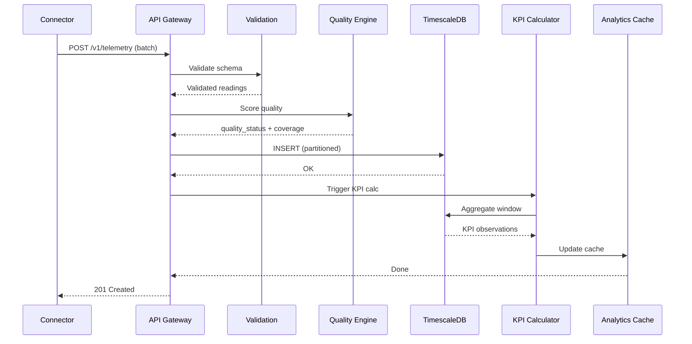

### 5.2 Cost Estimation Flow

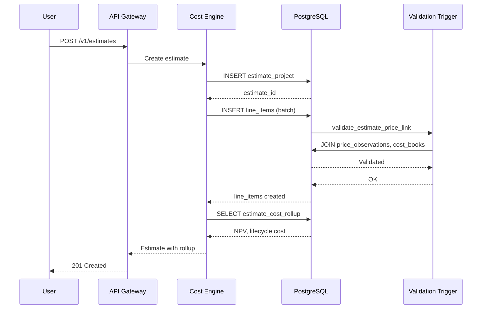

### 5.3 Evidence Chain Verification Flow

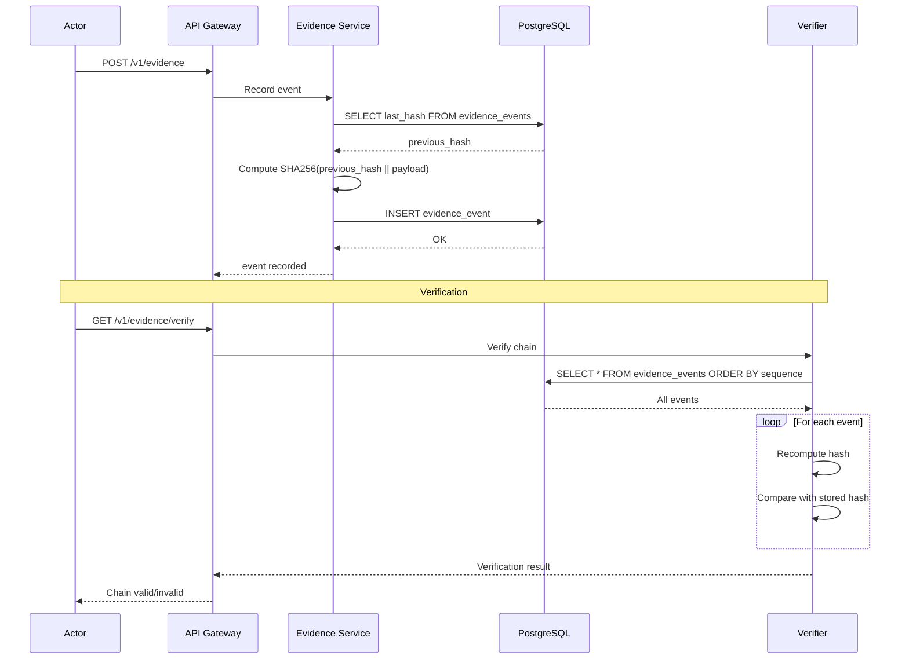

---

## 6. Partitioning Strategy

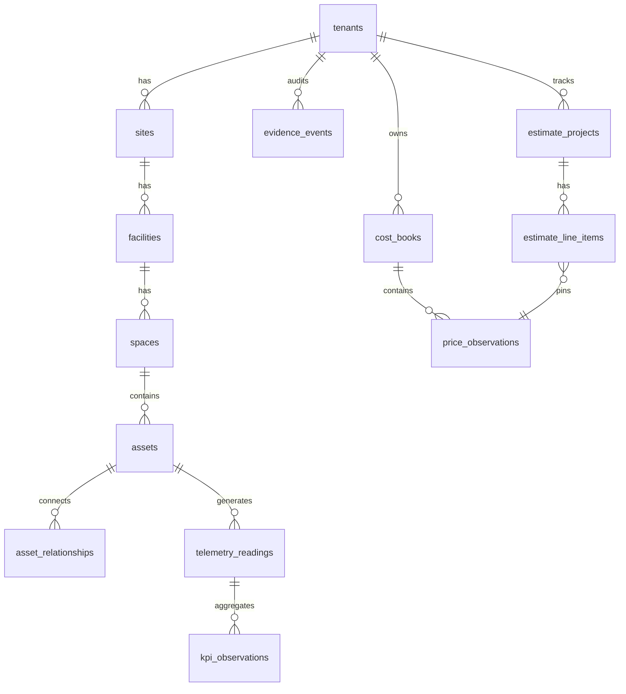

### Partitioning Scheme

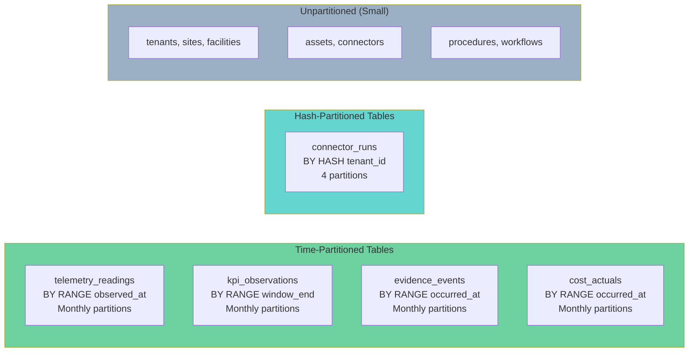

---

## 7. Caching Strategy

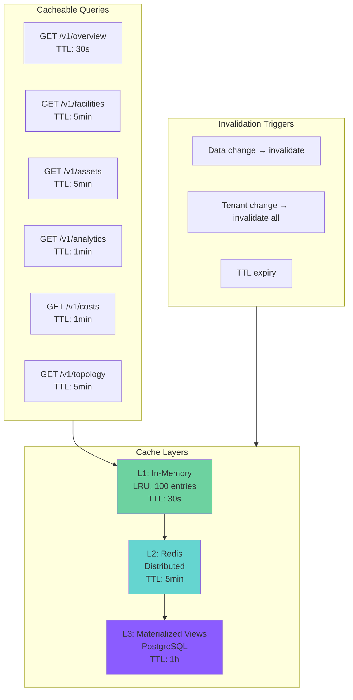

---

## 8. API Versioning & Pagination

```mermaid
graph LR
    subgraph V1["v1 (Current)"]
        P1[GET /v1/overview<br/>?tenant_id=&limit=&offset=]
        P2[GET /v1/assets<br/>?tenant_id=&limit=&offset=]
        P3[GET /v1/analytics<br/>?tenant_id=&window_days=]
    end

    subgraph V2["v2 (Target)"]
        Q1[GET /v2/overview<br/>?tenant_id=&cursor=]
        Q2[GET /v2/assets<br/>?tenant_id=&cursor=]
        Q3[GET /v2/analytics<br/>?tenant_id=&window_days=&cursor=]
    end

    subgraph Pagination["Pagination Strategy"]
        PG1[Offset: LIMIT/OFFSET<br/>Simple, O(n) offset cost]
        PG2[Cursor: Keyset<br/>WHERE id > cursor<br/>O(1) per page]
        PG3[Seek: Hybrid<br/>Best of both]
    end

    V1 --> Pagination
    V2 --> Pagination

    style V1 fill:#ffca72
    style V2 fill:#6dd2a0
    style PG2 fill:#65d5d0
```

---

## 9. Deployment Architecture

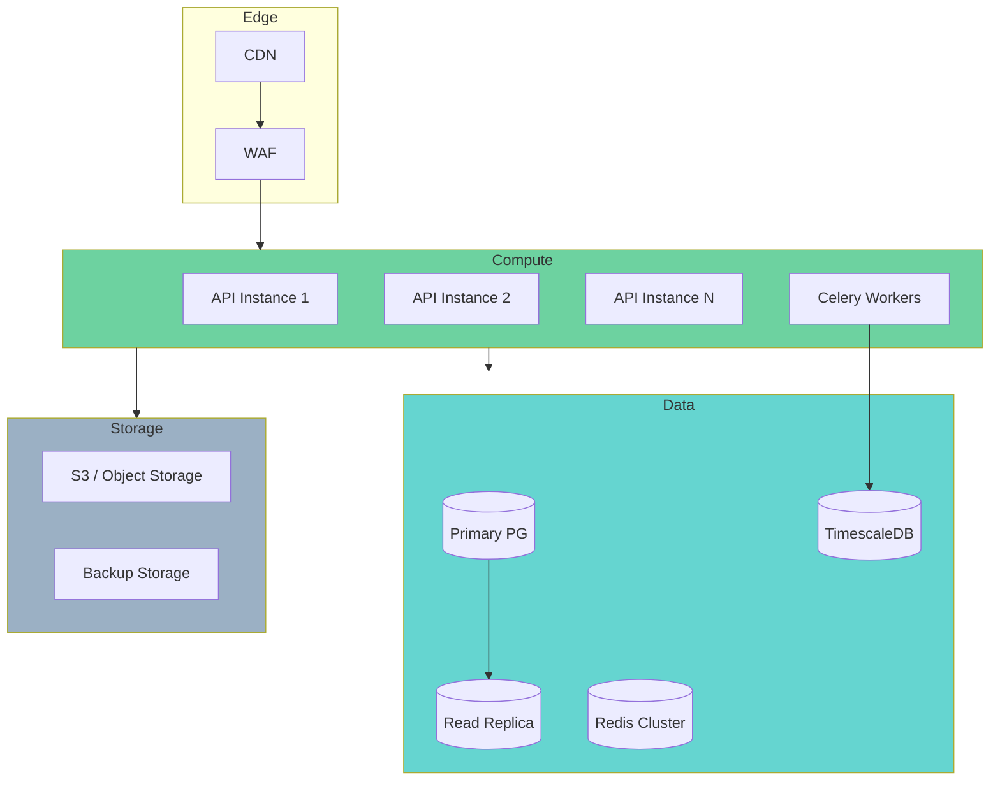

---

## 10. Implementation Roadmap

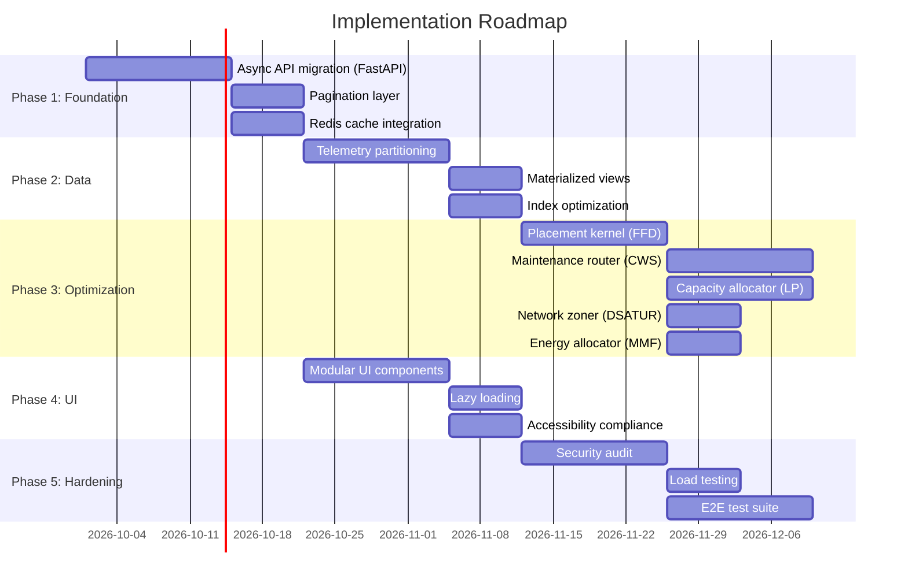

---

## 11. Evaluation Parameters

### 11.1 Performance Benchmarks

| Metric | Current | Target | Measurement |
|--------|---------|--------|-------------|
| API p99 latency | ~500ms | <100ms | k6 load test |
| Concurrent requests | ~8 | >1000 | k6 load test |
| DB query time (analytics) | ~2000ms | <200ms | EXPLAIN ANALYZE |
| UI first paint | ~3s | <1s | Lighthouse |
| Cache hit rate | 0% | >80% | Redis stats |
| Telemetry insert | ~100/s | >10000/s | pgbench |

### 11.2 Optimization Quality Benchmarks

| Problem | Algorithm | Approximation Ratio | Time Complexity |
|---------|-----------|---------------------|-----------------|
| Workload Placement | FFD | 11/9 × OPT | O(n log n) |
| Maintenance Routing | CWS + 2-opt | 2 × OPT | O(n² log n) |
| Capacity Allocation | LP + Rounding | (1-ε) × OPT | O(n³) |
| Network Zoning | DSATUR | ≤ Δ+1 | O(n²) |
| Energy Allocation | MMF | Pareto optimal | O(n log n) |

### 11.3 Evolution Parameters

```mermaid
graph LR
    subgraph Metrics["Evaluation Metrics"]
        M1[Latency p50/p99]
        M2[Throughput rps]
        M3[Error rate %]
        M4[Cache hit rate %]
        M5[DB connection utilization]
    end

    subgraph Evolution["Evolution Strategy"]
        E1[Weekly benchmark runs]
        E2[A/B test new algorithms]
        E3[Canary deployment]
        E4[Rollback on regression]
    end

    subgraph Gates["Quality Gates"]
        G1[p99 < 100ms]
        G2[Error rate < 0.1%]
        G3[Cache hit > 80%]
        G4[All tests pass]
    end

    Metrics --> Evolution --> Gates

    style Metrics fill:#65d5d0
    style Evolution fill:#ffca72
    style Gates fill:#6dd2a0
```

---

## 12. Summary

The current codebase is a solid foundation with clean domain modeling but significant performance and scalability gaps. The key improvements are:

1. **Async API** — Replace ThreadingHTTPServer with FastAPI + Uvicorn
2. **Pagination** — Add cursor-based pagination to all list endpoints
3. **Caching** — Redis layer with TTL-based invalidation
4. **Partitioning** — Time-based partitioning for telemetry and evidence tables
5. **Optimization Kernels** — 5 NP-hard problem solvers with approximation algorithms
6. **Modular UI** — Split 84KB monolith into lazy-loaded components
7. **Materialized Views** — Pre-compute common aggregations
8. **Index Optimization** — Composite indexes for tenant-scoped queries

All changes maintain the read-only, tenant-scoped, evidence-backed design principles of the original system.
