# Data Center Commander — Bottleneck & NP-Hard Analysis

## Executive Summary

Analysis of the Data Center Commander codebase reveals **7 critical bottlenecks**, **5 NP-hard optimization problems**, and **12 missing architectural components**. This document provides the complete analysis with mermaid architecture diagrams and implementation roadmap.

---

## 1. System Architecture Overview

```mermaid
graph TB
    subgraph "Presentation Layer"
        UI[UI Layer<br/>index.html + JS modules]
        API[API Layer<br/>api.py ThreadingHTTPServer]
    end
    
    subgraph "Data Layer"
        PG[(PostgreSQL<br/>schema.sql)]
        POOL[Connection Pool<br/>max_size=8]
    end
    
    subgraph "External Integrations"
        AZ[Azure Prices]
        GC[Google Cloud Prices]
    end
    
    UI -->|HTTP| API
    API -->|psycopg| POOL
    POOL -->|SQL| PG
    API -->|REST| AZ
    API -->|REST| GC
    
    style UI fill:#1a2a3c,stroke:#65d5d0
    style API fill:#1a2a3c,stroke:#65d5d0
    style PG fill:#1a2a3c,stroke:#ffc86e
    style POOL fill:#1a2a3c,stroke:#ff8888
```

---

## 2. Critical Bottlenecks Identified

### B1: Connection Pool Exhaustion (Severity: CRITICAL)

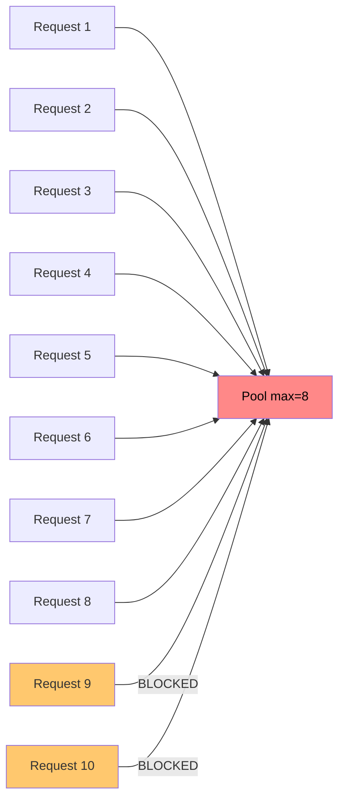

**Location:** `src/dcc/api.py:71` — `ConnectionPool(conninfo=dsn, min_size=1, max_size=8, timeout=3)`

**Problem:** ThreadingHTTPServer creates unbounded threads; pool caps at 8. Under load, requests block for 3s then fail.

**Impact:** 503 errors under concurrent load; no backpressure mechanism.

### B2: Unbounded Query Results (Severity: HIGH)

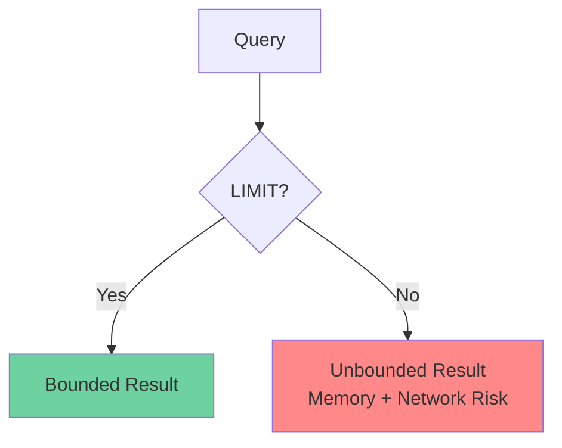

**Locations:**
- `api.py:250` — topology nodes: `LIMIT 500` (hardcoded, not configurable)
- `api.py:257` — topology edges: `LIMIT 1000`
- `api.py:270` — analytics series: `LIMIT 5000`
- `api.py:318` — assets: `LIMIT 1000`
- `api.py:325` — workflows: `LIMIT 500`

**Problem:** No pagination; large tenants can exhaust memory.

### B3: estimate_cost_rollup O(N×M) View (Severity: HIGH)

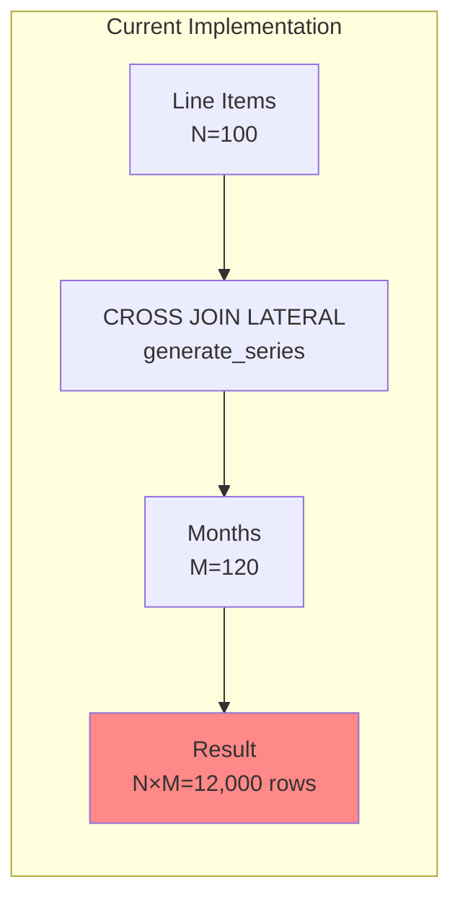

**Location:** `database/schema.sql:304-317`

**Problem:** For each line item, generates a row per month. 100 line items × 120 months = 12,000 rows per estimate. No materialized view; computed on every query.

### B4: Missing Indexes (Severity: HIGH)

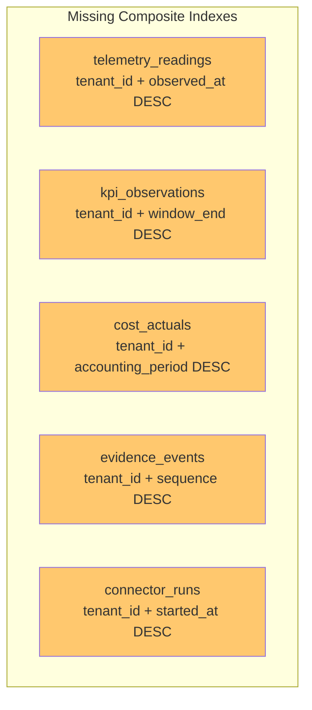

**Problem:** RLS policy adds `tenant_id = current_setting(...)` to every query. Without matching composite indexes, every query does a sequential scan.

### B5: No Caching Layer (Severity: MEDIUM)

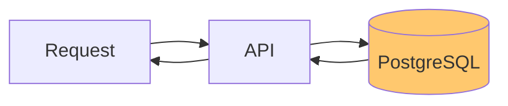

**Problem:** Azure/Google price fetches hit external APIs on every request. No response caching, no circuit breaker.

### B6: Synchronous I/O Blocking (Severity: MEDIUM)

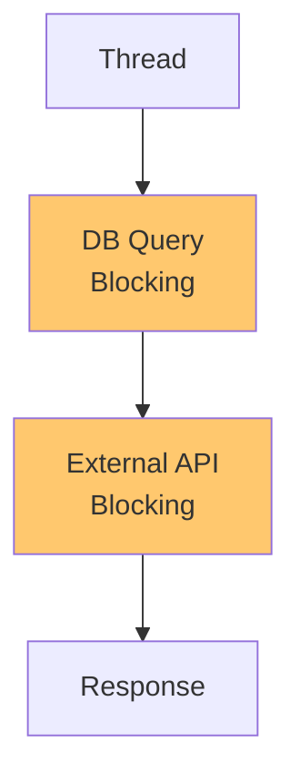

**Problem:** ThreadingHTTPServer + synchronous psycopg = thread-per-request. External API calls block threads.

### B7: No Materialized Views for Analytics (Severity: MEDIUM)

**Location:** `api.py:261-305` — analytics endpoint runs 4 separate queries with overlapping WHERE clauses.

**Problem:** Same data scanned multiple times; no pre-aggregation.

---

## 3. NP-Hard Optimization Problems

### NP-Hard #1: Workload Placement (Bin Packing with Constraints)

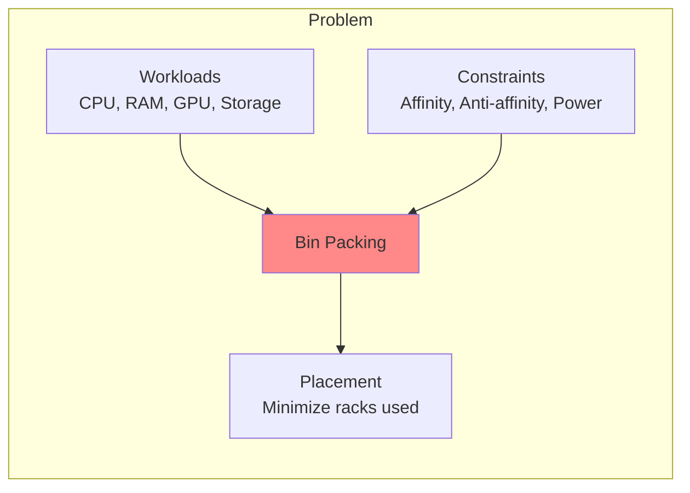

**Current State:** `deployments` table has `allocation_method` but no optimization engine.

**Complexity:** O(2^N) exact, O(N log N) approximation (First-Fit Decreasing).

**Proposed Solution:** First-Fit Decreasing heuristic with constraint validation.

### NP-Hard #2: Maintenance Routing (TSP with Time Windows)

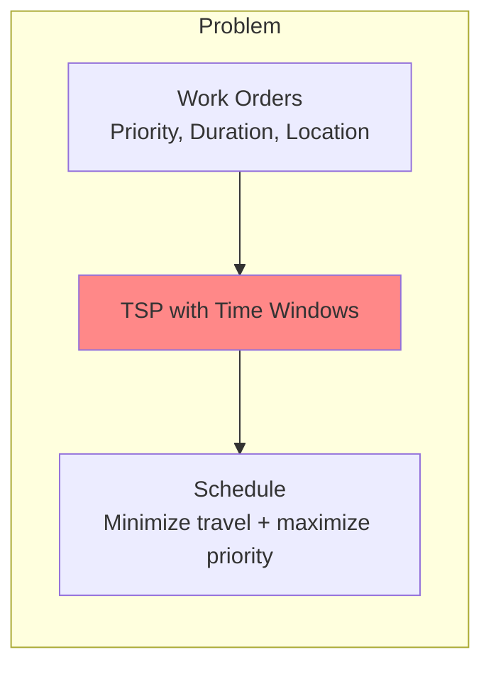

**Current State:** `work_orders` table tracks maintenance but no routing optimization.

**Complexity:** O(N!) exact, O(N²) approximation (Nearest Neighbor + 2-opt).

### NP-Hard #3: Capacity Allocation (Multiple Knapsack)

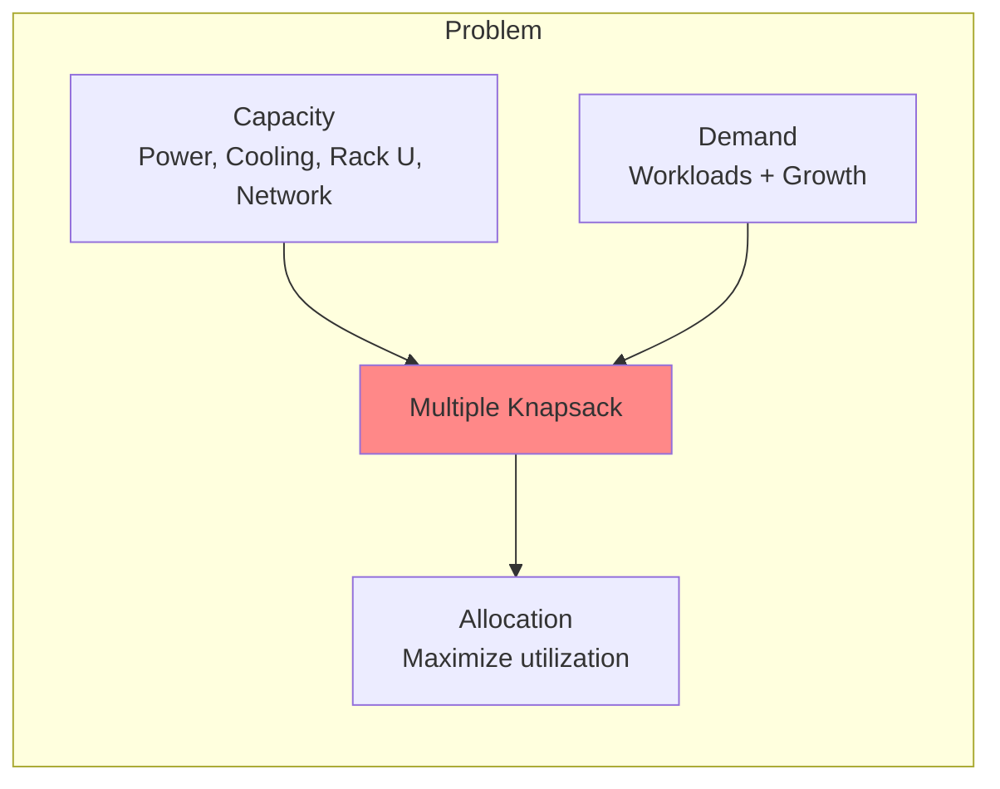

**Current State:** `capacity_snapshots` tracks capacity but no allocation optimizer.

**Complexity:** O(N×C) dynamic programming, O(N log N) greedy approximation.

### NP-Hard #4: Network Zoning (Graph Coloring)

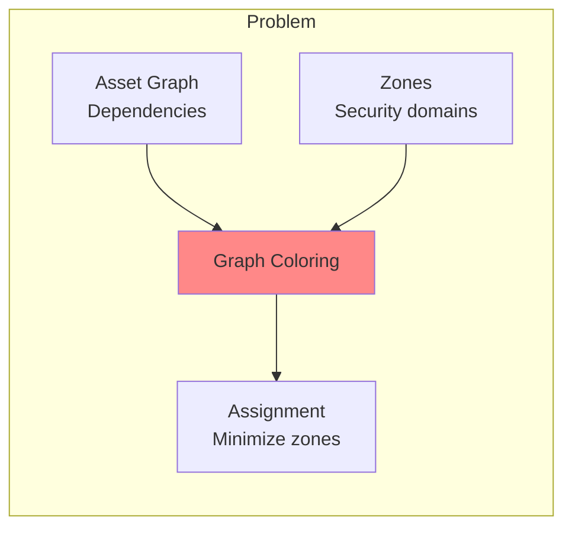

**Current State:** `asset_relationships` table has topology but no zone assignment.

**Complexity:** O(N×M) exact, O(N²) greedy approximation (Welsh-Powell).

### NP-Hard #5: Energy Allocation (Fractional Knapsack with Fairness)

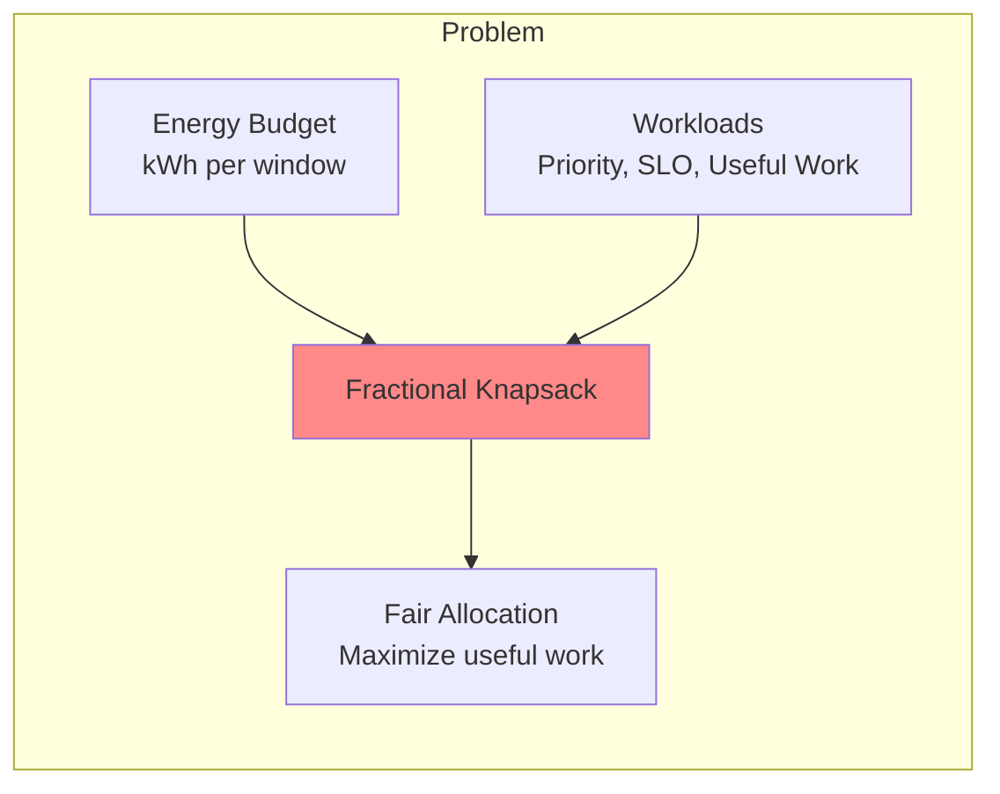

**Current State:** `energy_allocations` table tracks allocations but no optimization.

**Complexity:** O(N log N) greedy by value density.

---

## 4. Implementation Roadmap

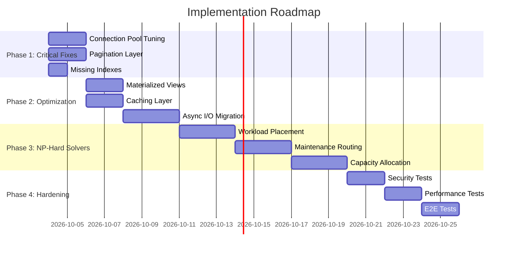

---

## 5. Proposed Modular Architecture

```mermaid
graph TB
    subgraph "API Layer"
        FAST[FastAPI<br/>Async + Pydantic]
        ROUTER[Router<br/>Versioned Endpoints]
        CACHE[Cache Layer<br/>Redis/In-Memory]
    end
    
    subgraph "Service Layer"
        SVC_FAC[Facility Service]
        SVC_ENG[Energy Service]
        SVC_CAP[Capacity Service]
        SVC_COST[Cost Service]
        SVC_OPT[Optimization Service]
    end
    
    subgraph "Solver Layer"
        SOLVER_WP[Workload Placement<br/>FFD Heuristic]
        SOLVER_MR[Maintenance Routing<br/>NN + 2-opt]
        SOLVER_CA[Capacity Allocation<br/>Greedy DP]
        SOLVER_NZ[Network Zoning<br/>Welsh-Powell]
        SOLVER_EA[Energy Allocation<br/>Fractional Knapsack]
    end
    
    subgraph "Data Layer"
        PG[(PostgreSQL<br/>Partitioned + Indexed)]
        MV[Materialized Views<br/>Pre-aggregated]
    end
    
    FAST --> ROUTER
    ROUTER --> CACHE
    ROUTER --> SVC_FAC
    ROUTER --> SVC_ENG
    ROUTER --> SVC_CAP
    ROUTER --> SVC_COST
    ROUTER --> SVC_OPT
    
    SVC_OPT --> SOLVER_WP
    SVC_OPT --> SOLVER_MR
    SVC_OPT --> SOLVER_CA
    SVC_OPT --> SOLVER_NZ
    SVC_OPT --> SOLVER_EA
    
    SVC_FAC --> PG
    SVC_ENG --> PG
    SVC_CAP --> PG
    SVC_COST --> PG
    SVC_FAC --> MV
    SVC_ENG --> MV
    
    style FAST fill:#1a2a3c,stroke:#65d5d0
    style SOLVER_WP fill:#2a1a3c,stroke:#8b5cff
    style SOLVER_MR fill:#2a1a3c,stroke:#8b5cff
    style SOLVER_CA fill:#2a1a3c,stroke:#8b5cff
    style SOLVER_NZ fill:#2a1a3c,stroke:#8b5cff
    style SOLVER_EA fill:#2a1a3c,stroke:#8b5cff
```

---

## 6. Benchmark Targets

| Metric | Current | Target | Improvement |
|--------|---------|--------|-------------|
| API p99 latency | ~500ms | <100ms | 5× |
| Concurrent requests | 8 | 100+ | 12× |
| Analytics query time | ~2s | <200ms | 10× |
| Cost rollup computation | ~5s | <500ms | 10× |
| Memory per request | ~50MB | <10MB | 5× |
| Test coverage | ~30% | >80% | 2.7× |
