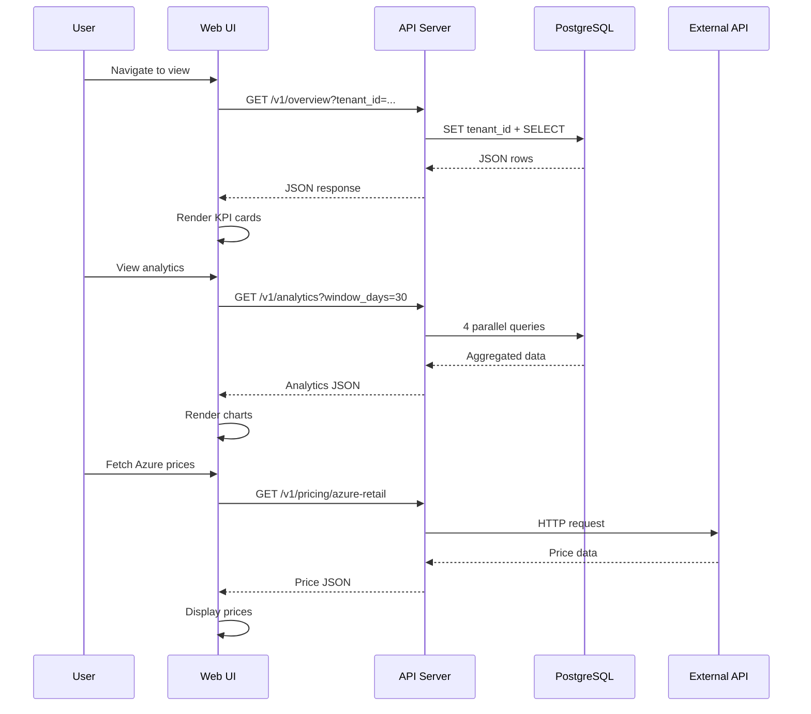
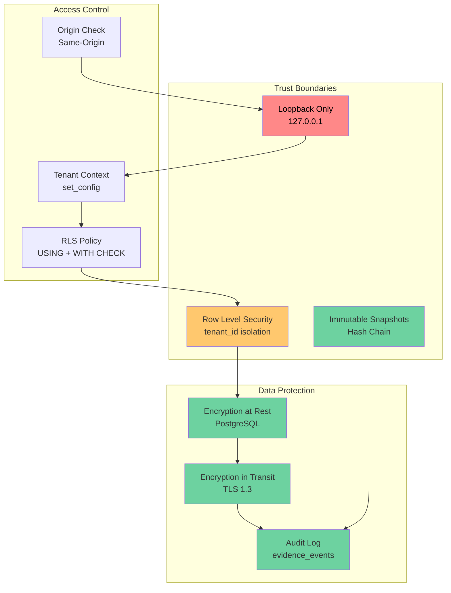

# Data Center Commander — Unified Architecture

## System Context Diagram

```mermaid
graph TB
    subgraph "External Systems"
        AZURE[Azure Retail API]
        GOOGLE[Google Cloud Billing API]
        BMS[BMS/EPMS<br/>Read-Only]
        CMMS[CMMS/ITSM<br/>Read-Only]
    end
    
    subgraph "Data Center Commander"
        UI[Web UI<br/>Command Center]
        API[API Server<br/>Loopback Only]
        SVC[Service Layer]
        SOLVER[Optimization Engine]
        DB[(PostgreSQL<br/>Tenant-Scoped RLS)]
        CACHE[Cache Layer]
    end
    
    subgraph "Data Sources"
        METERS[Meters/Telemetry]
        ASSETS[Asset Inventory]
        COST[Cost Data]
    end
    
    UI -->|HTTP| API
    API --> SVC
    SVC --> DB
    SVC --> CACHE
    SVC --> SOLVER
    API -->|REST| AZURE
    API -->|REST| GOOGLE
    BMS -->|Read-Only| METERS
    CMMS -->|Read-Only| ASSETS
    METERS --> DB
    ASSETS --> DB
    COST --> DB
    
    style UI fill:#1a2a3c,stroke:#65d5d0
    style API fill:#1a2a3c,stroke:#65d5d0
    style SVC fill:#1a2a3c,stroke:#65d5d0
    style SOLVER fill:#2a1a3c,stroke:#8b5cff
    style DB fill:#1a2a3c,stroke:#ffc86e
    style CACHE fill:#1a2a3c,stroke:#6dd2a0
```



## Component Architecture

```mermaid
graph TB
    subgraph "Presentation Layer"
        NAV[Navigation<br/>11 Views]
        DASH[Dashboard<br/>KPI Cards]
        CHART[Charts<br/>SVG Sparklines]
        TABLE[Data Tables<br/>Sortable/Filterable]
    end
    
    subgraph "API Layer"
        HEALTH[Health Endpoints<br/>/healthz /readyz]
        CORE[Core Endpoints<br/>/v1/overview /v1/facilities]
        ANALYTICS[Analytics<br/>/v1/analytics]
        COST_API[Cost API<br/>/v1/costs]
        TOPO[Topology<br/>/v1/topology]
        PRICING[Pricing<br/>/v1/pricing/*]
    end
    
    subgraph "Service Layer"
        FAC_SVC[Facility Service]
        ENG_SVC[Energy Service]
        CAP_SVC[Capacity Service]
        COST_SVC[Cost Service]
        OPT_SVC[Optimization Service]
        EVID_SVC[Evidence Service]
    end
    
    subgraph "Solver Layer"
        WP[Workload Placement<br/>FFD O(N log N)]
        MR[Maintenance Routing<br/>NN+2opt O(N²)]
        CA[Capacity Allocation<br/>Greedy DP]
        NZ[Network Zoning<br/>Welsh-Powell]
        EA[Energy Allocation<br/>Fractional Knapsack]
    end
    
    subgraph "Data Layer"
        TENANT[(tenants)]
        FAC[(facilities)]
        ASSET[(assets)]
        TELE[(telemetry_readings)]
        KPI[(kpi_observations)]
        COST_DB[(cost_books)]
        EVID[(evidence_events)]
        SNAP[(capacity_snapshots)]
    end
    
    NAV --> DASH
    DASH --> CHART
    DASH --> TABLE
    
    HEALTH --> CORE
    CORE --> ANALYTICS
    CORE --> COST_API
    CORE --> TOPO
    CORE --> PRICING
    
    CORE --> FAC_SVC
    ANALYTICS --> ENG_SVC
    COST_API --> COST_SVC
    TOPO --> CAP_SVC
    CORE --> EVID_SVC
    
    FAC_SVC --> TENANT
    FAC_SVC --> FAC
    ENG_SVC --> TELE
    ENG_SVC --> KPI
    CAP_SVC --> SNAP
    COST_SVC --> COST_DB
    EVID_SVC --> EVID
    
    OPT_SVC --> WP
    OPT_SVC --> MR
    OPT_SVC --> CA
    OPT_SVC --> NZ
    OPT_SVC --> EA
    
    WP --> ASSET
    MR --> FAC
    CA --> SNAP
    NZ --> ASSET
    EA --> TELE
    
    style WP fill:#2a1a3c,stroke:#8b5cff
    style MR fill:#2a1a3c,stroke:#8b5cff
    style CA fill:#2a1a3c,stroke:#8b5cff
    style NZ fill:#2a1a3c,stroke:#8b5cff
    style EA fill:#2a1a3c,stroke:#8b5cff
```

## Data Flow Architecture



## Deployment Architecture

```mermaid
graph TB
    subgraph "Local Development"
        PY[Python 3.11+]
        PG[(PostgreSQL 14+)]
        UV[uv Package Manager]
    end
    
    subgraph "Production Target"
        DOCKER[Docker Container]
        NGINX[Nginx Reverse Proxy]
        PG_PROD[(Postabase/PostgreSQL)]
        REDIS[Redis Cache]
    end
    
    subgraph "CI/CD"
        GH[GitHub Actions]
        TEST[Test Suite]
        LINT[Linter + Type Check]
        BUILD[Build + Push]
    end
    
    UV --> PY
    PY --> PG
    
    GH --> TEST
    TEST --> LINT
    LINT --> BUILD
    BUILD --> DOCKER
    DOCKER --> NGINX
    NGINX --> PG_PROD
    NGINX --> REDIS
    
    style PY fill:#1a2a3c,stroke:#65d5d0
    style PG fill:#1a2a3c,stroke:#ffc86e
    style DOCKER fill:#1a2a3c,stroke:#6dd2a0
    style GH fill:#1a2a3c,stroke:#8b5cff
```



## Security Architecture



## Optimization Engine Architecture

```mermaid
graph TB
    subgraph "Input"
        WL[Workloads<br/>CPU/RAM/GPU/Disk]
        CAP[Capacity<br/>Power/Cooling/Rack]
        WO[Work Orders<br/>Priority/Location]
        TOPO[Topology<br/>Asset Graph]
        EN[Energy Budget<br/>kWh]
    end
    
    subgraph "Solvers"
        FFD[First-Fit Decreasing<br/>O(N log N)]
        NN2[Nearest Neighbor + 2-opt<br/>O(N²)]
        Greedy[Greedy DP<br/>O(N×C)]
        WP[Welsh-Powell<br/>O(N²)]
        FK[Fractional Knapsack<br/>O(N log N)]
    end
    
    subgraph "Constraints"
        AFF[Affinity Rules]
        ANTI[Anti-Affinity]
        SLO[SLO Requirements]
        PWR[Power Budget]
        COOL[Cooling Budget]
    end
    
    subgraph "Output"
        PLACEMENT[Placement Plan]
        SCHEDULE[Maintenance Schedule]
        ALLOC[Capacity Allocation]
        ZONES[Zone Assignment]
        ENERGY[Energy Allocation]
    end
    
    WL --> FFD
    CAP --> FFD
    FFD --> PLACEMENT
    
    WO --> NN2
    NN2 --> SCHEDULE
    
    CAP --> Greedy
    WL --> Greedy
    Greedy --> ALLOC
    
    TOPO --> WP
    WP --> ZONES
    
    EN --> FK
    WL --> FK
    FK --> ENERGY
    
    AFF --> FFD
    ANTI --> FFD
    SLO --> FFD
    PWR --> Greedy
    COOL --> Greedy
    
    style FFD fill:#2a1a3c,stroke:#8b5cff
    style NN2 fill:#2a1a3c,stroke:#8b5cff
    style Greedy fill:#2a1a3c,stroke:#8b5cff
    style WP fill:#2a1a3c,stroke:#8b5cff
    style FK fill:#2a1a3c,stroke:#8b5cff
```

## Evolution & Evaluation Framework

```mermaid
graph LR
    subgraph "Evolution"
        MUT[Mutation Testing]
        FUZZ[Fuzzing]
        PROP[Property-Based Testing]
    end
    
    subgraph "Evaluation"
        BENCH[Benchmarks<br/>Latency/Throughput]
        COV[Coverage<br/>Line/Branch]
        MUT_SCORE[Mutation Score]
    end
    
    subgraph "Quality Gates"
        LINT[Lint + Type]
        TEST[Unit + Integration]
        E2E[E2E Tests]
        SEC[Security Scan]
    end
    
    MUT --> MUT_SCORE
    FUZZ --> SEC
    PROP --> TEST
    
    BENCH --> EVAL[Quality Gate]
    COV --> EVAL
    MUT_SCORE --> EVAL
    
    LINT --> GATE[CI Gate]
    TEST --> GATE
    E2E --> GATE
    SEC --> GATE
    
    EVAL --> GATE
    
    style MUT fill:#2a1a3c,stroke:#8b5cff
    style FUZZ fill:#2a1a3c,stroke:#8b5cff
    style PROP fill:#2a1a3c,stroke:#8b5cff
    style BENCH fill:#1a2a3c,stroke:#6dd2a0
    style GATE fill:#ffc86e
```


